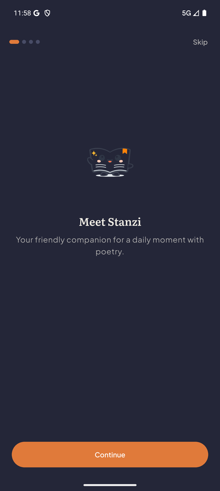
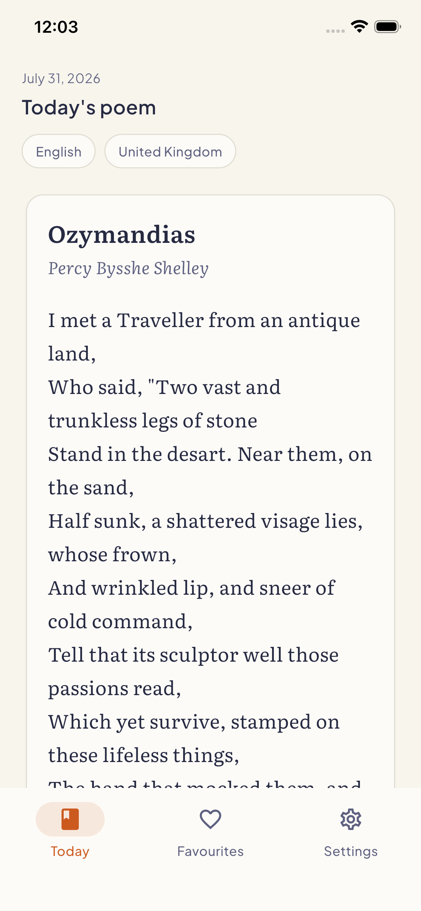
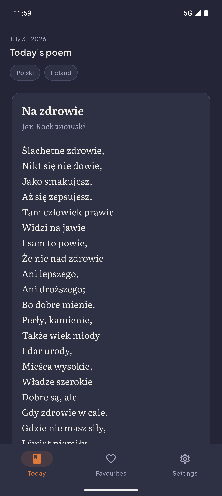
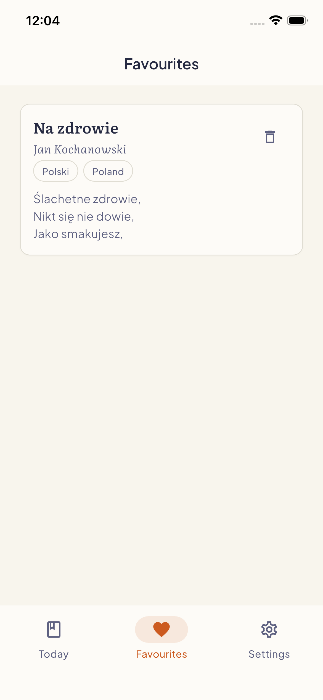
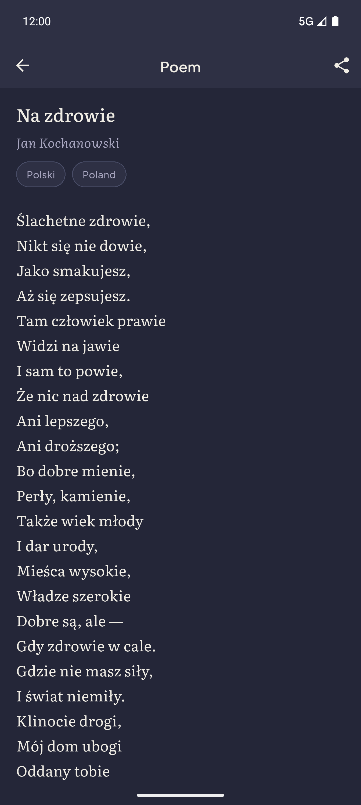
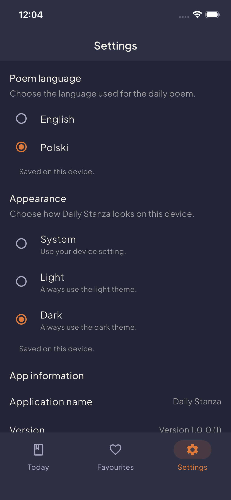

# Daily Stanza

One curated public-domain poem each day, in English or Polish.

## Overview

Daily Stanza is a Flutter application that presents one curated public-domain
poem per day. Readers can choose between English and Polish content, save
favourite poems, adjust language and appearance preferences, share poems, and
read in a comfortable detail view. Poems are assigned deterministically for up
to one year in advance, with new content added through a human-verified
catalog workflow.

## Screenshots

| Android — Onboarding | iOS — Today, English |
|:---:|:---:|
|  |  |

| Android — Today, Polish | iOS — Favourites |
|:---:|:---:|
|  |  |

| Android — Poem detail | iOS — Dark theme |
|:---:|:---:|
|  |  |

Additional Android and iOS screens are available in
[`docs/screenshots`](docs/screenshots).

## Features

The following functionality is implemented in the current build:

- **Daily poem retrieval** — reads the day's assignment from Firestore and
  displays the poem text, title, and author on the Today screen.
- **English and Polish poem preferences** — the reader selects a language in
  Settings; the app loads the corresponding daily assignment.
- **Local favourites** — poems can be bookmarked and viewed in a dedicated
  Favourites tab. Favourites are persisted locally with `SharedPreferences`.
- **Poem detail screen** — a full-screen, scrollable reading view accessible
  from Today and Favourites.
- **Sharing** — poems can be shared via the native share sheet using
  `share_plus`. The share format includes title, author, poem text, and the
  "Shared from Daily Stanza" attribution.
- **Onboarding** — first-launch flow guides the reader through language and
  appearance selection before reaching the main app.
- **Light, dark and system appearance** — the app follows the device theme
  when System is selected, or locks to Light or Dark from Settings.
- **Responsive Android and iOS UI** — bottom navigation bar, adaptive layouts.
- **Local preference persistence** — language, theme, and onboarding completion
  are persisted with `SharedPreferences`.
- **Controlled loading, unavailable and error states** — the Today screen
  displays distinct states for loading, missing/unavailable poems, network
  failures, permission errors, and unknown failures, each with contextual UI
  and retry support.
- **Offline cache awareness** — a banner indicates when the displayed poem was
  served from the local Firestore cache.

## Technology

- **Flutter** — stable channel (Dart SDK constraint `^3.12.2` from `pubspec.yaml`)
- **Material 3** — theming with Literata (poem body) and Plus Jakarta Sans (UI)
  typography
- **BLoC / Cubit** — state management via `flutter_bloc` ^9.1.1
- **GoRouter** — declarative routing with `StatefulShellRoute` for bottom
  navigation and onboarding redirects
- **Firebase Core** and **Cloud Firestore** — poem data and daily assignment
  delivery
- **SharedPreferences** — local persistence for preferences and favourites
- **Equatable** — value equality for state classes
- **share_plus** — native share sheet integration
- **package_info_plus** — app version display in Settings
- **url_launcher** — external links (GitHub, privacy policy)
- **Automated testing** — unit, widget, and BLoC tests with `flutter_test`,
  `bloc_test`, and `mocktail`; Firestore Rules tests with Jest
- **CI** — GitHub Actions (`flutter_ci.yml`) runs formatting checks, static
  analysis, tests, debug APK build, and Firestore Rules tests on push and PR

## Architecture

Daily Stanza follows a feature-first layered architecture with clear
separation of presentation, domain, and data responsibilities. Each feature
is self-contained and communicates with the data layer through abstract
repository interfaces.

See [docs/architecture.md](docs/architecture.md) for the full architecture
overview including a dependency-flow diagram.

## Content model

- 16 poems in the initial catalog: 8 English and 8 Polish.
- 730 deterministic daily assignments covering one full year (365 English +
  365 Polish).
- Each entry retains exact source URLs and rights metadata from the catalog
  record.
- Additions require human verification of source, authorship, and rights
  status before approval.
- Firestore Security Rules limit client reads to approved poems
  (`isApproved: true`) and published assignments (`isPublished: true`).

## Getting started

**Prerequisites**

- Flutter SDK (stable channel)
- Dart SDK matching the `sdk: ^3.12.2` constraint in `pubspec.yaml` (bundled
  with Flutter)
- Firebase CLI (for emulator workflows)
- Node.js 22 (for Firestore Rules tests)

**Clone and install dependencies**

```sh
git clone https://github.com/recipesforsoftware-pl/daily_stanza.git
cd daily_stanza
flutter pub get
```

**Firebase configuration**

Firebase client configuration files (`lib/firebase_options.dart`,
`android/app/google-services.json`, `ios/Runner/GoogleService-Info.plist`) are
intentionally excluded from the repository. Authorized maintainers restore
them with:

```sh
./tool/setup_firebase_config.sh
```

A fresh clone cannot build or analyze the production composition root until
local Firebase configuration is restored.

See [docs/development.md](docs/development.md) for detailed setup and workflow
instructions.

## Quality and testing

```sh
# Code formatting check
git ls-files -z '*.dart' | xargs -0 dart format --output=none --set-exit-if-changed

# Static analysis
flutter analyze

# Run all Dart tests
flutter test

# Firestore Rules tests (requires Node.js 22 and Java 21)
firebase emulators:exec --only firestore --project demo-daily-stanza \
  "cd firebase && node ./node_modules/jest/bin/jest.js --runInBand"
```

CI (`.github/workflows/flutter_ci.yml`) runs formatting checks, `flutter
analyze`, `flutter test`, and a debug APK build on every push and pull request
to `main`. A separate `firestore-rules` job runs the Firestore Rules tests.

## Repository structure

```
lib/
  core/
    config/          — environment parsing, route constants
    firebase/        — Firebase bootstrap (production/emulator)
    router/          — GoRouter configuration
    theme/           — Material 3 theme, colours, typography
    widgets/         — shared widgets (scaffold with nav bar)
  features/
    daily_poem/      — Today screen, poem retrieval BLoC
    favourites/      — Favourites tab, Cubit, local data source
    onboarding/      — first-launch flow, Cubit
    poem_details/    — focused reading view
    settings/        — language, theme, app info
    share_poem/      — share logic, Cubit, share_plus integration
  app.dart           — root widget
  main.dart          — composition root, dependency injection
test/                — unit, widget, BLoC tests per feature
firebase/
  seed/              — poem catalog JSON, authoring guide, sources
  admin/             — administrative import tooling
  test/              — Firestore Rules tests
tool/                — seed, validation, provenance, secret-check scripts
```

## Security

- **Read-only client access** — Firestore Security Rules grant read access
  only to documents with `isApproved == true` (poems) or
  `isPublished == true` (daily assignments). Writes from client applications
  are denied.
- **Administrative tooling** — production catalog imports use a separate,
  authenticated process outside the mobile runtime.
- **Credentials** — Firebase client configuration, service-account keys, and
  Firebase CLI tokens must never be committed to the repository. Local
  configuration is restored from a secure, repository-external location.
- **Ignored files** — all Firebase client configuration files are listed in
  `.gitignore`.

## License

The Daily Stanza source code and project documentation are licensed under the
[MIT License](LICENSE).

Copyright © 2026 Konrad Szewczuk (Recipes For Software).

Poem texts retain their original authorship and source attribution. The
included catalog records use source and rights metadata documented in
`firebase/seed/CONTENT_SOURCES.md`. Third-party packages, fonts and external
materials remain subject to their respective licenses or terms.

## Status

Daily Stanza is under active development. The source code and project
documentation are available under the MIT License.
