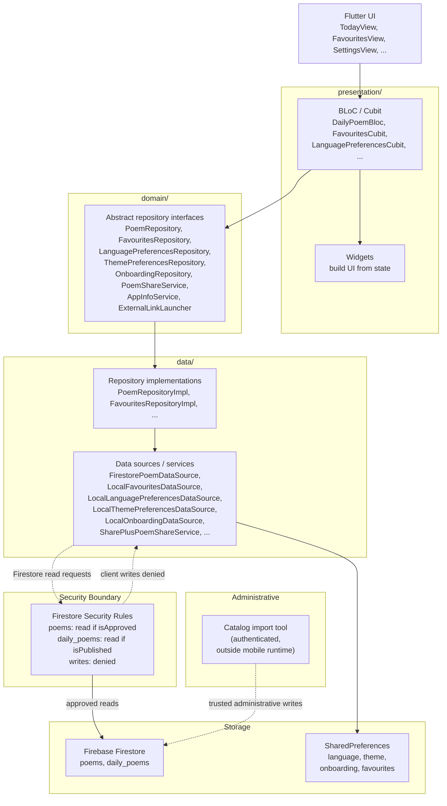

# Architecture — Daily Stanza

## Goals

- **Separation of concerns** — presentation, domain logic, and data access are
  cleanly separated per feature.
- **Testability** — presentation layers depend on abstract repository
  interfaces, enabling isolated unit tests with mock data sources.
- **Offline resilience** — production Firestore persistence supports cached
  reads when the network is unavailable.
- **Emulator parity** — a `--dart-define=USE_FIRESTORE_EMULATOR=true` flag
  switches the Firestore client to a local emulator without code changes.

## Feature-first layered organisation

Each feature under `lib/features/` is self-contained and may include:

- **presentation/** — BLoC or Cubit, state classes, views, widgets
- **domain/** — abstract repository interfaces, domain models, failure types
- **data/** — repository implementations, data sources (Firestore,
  SharedPreferences), DTOs, service implementations

Shared infrastructure lives under `lib/core/`:

- `config/` — `AppEnvironment` reads Dart defines for emulator configuration
- `firebase/` — `FirebaseBootstrap` initialises Firebase and configures
  Firestore for production or emulator mode
- `router/` — GoRouter configuration with `StatefulShellRoute` for bottom
  navigation, onboarding redirects, and poem-detail routes
- `theme/` — Material 3 theme data, colours, typography (Literata,
  Plus Jakarta Sans), spacing
- `widgets/` — shared widgets such as `ScaffoldWithNavBar`

## State flow



### Description of the flow

1. **Flutter UI** renders views and dispatches events to BLoCs or calls Cubit
   methods.
2. **BLoC / Cubit** (presentation) calls abstract repository interfaces
   defined in the domain layer.
3. **Repository implementations** (data) delegate to concrete data sources:
   `FirestorePoemDataSource` for poem data and local data sources backed by
   `SharedPreferences` for preferences and favourites.
4. **Firebase Firestore** stores approved poems and published daily
   assignments. **SharedPreferences** persists language, theme, onboarding
   completion, and favourite poem IDs.
5. **Firestore Security Rules** enforce read-only access from client
   applications — only documents flagged as approved/published are readable.
   Writes from mobile clients are unconditionally denied.
6. **Administrative catalog import** (`firebase/admin/import_catalog.mjs`) runs
   outside the mobile runtime using Application Default Credentials and is the
   intended trusted administrative path for production catalog writes.

## BLoC / Cubit state pattern

- **DailyPoemBloc** — receives `DailyPoemRequested` and
  `DailyPoemRetryRequested` events, calls `PoemRepository.getDailyPoem()`,
  emits `DailyPoemLoading`, then either `DailyPoemLoaded`, `DailyPoemMissing`,
  or `DailyPoemFailure` with typed failure enum.
- **FavouritesCubit** — manages a list of favourite poem IDs, loads from
  `FavouritesRepository`, emits `FavouritesLoaded` or `FavouritesError`.
- **LanguagePreferencesCubit** / **ThemePreferencesCubit** — read and persist
  user preferences through their respective repository interfaces.
- **PoemShareCubit** — calls `PoemShareService.share()` with the formatted
  text and emits the share result.
- **OnboardingCubit** — tracks first-launch completion state, drives
  GoRouter redirects via `createRouter()`.

## Repository abstraction

Presentation layers never reference concrete data sources, Firebase types, or
`SharedPreferences` directly. Dependencies are injected at the composition root
(`main.dart`) through `RepositoryProvider` widgets:

```dart
RepositoryProvider<PoemRepository>.value(
  value: PoemRepositoryImpl(dataSource: FirestorePoemDataSource(...)),
)
```

This allows each layer to be tested independently with `mocktail` or
`fake_cloud_firestore`.

## GoRouter navigation

- `/splash` — initial route while onboarding status is being resolved
- `/onboarding` — first-launch language/theme selection flow
- `/today` — Today screen (default after onboarding)
- `/today/poem/:id` — poem detail (full-screen, no bottom nav)
- `/favourites` — saved poems list
- `/favourites/poem/:id` — poem detail from favourites
- `/settings` — language, theme, app info

Onboarding redirect logic in `_onboardingRedirect` ensures the user cannot
reach the main app until onboarding is complete.

## Error / failure mapping

Domain-level failures (`DailyPoemNotFoundFailure`, `PoemNotFoundFailure`,
`NetworkFailure`, `PermissionFailure`, `InvalidPoemDataFailure`,
`UnknownFailure`) are caught by `DailyPoemBloc` and mapped to
`DailyPoemState` subtypes. UI components render the appropriate state through
`DailyPoemStatusView`.

Global error listeners on `FavouritesCubit`, `LanguagePreferencesCubit`,
`ThemePreferencesCubit`, `OnboardingCubit`, and `PoemShareCubit` surface
mutation errors as `SnackBar` messages through a shared
`ScaffoldMessengerState` key.

## Firebase Security Rules boundary

- Client applications have read-only access to approved/published documents.
- Writes (create, update, delete) are unconditionally denied by Security Rules.
- The administrative catalog import (`firebase/admin/import_catalog.mjs`) runs
  outside the mobile runtime with Application Default Credentials and bypasses
  Security Rules for trusted data ingestion.
- Emulator seeding (`tool/seed_firestore.dart`) uses the `Bearer owner` token
  which also bypasses rules in the local emulator.

## Testing strategy

- **Unit tests** — data sources, repositories, DTOs, services, domain models,
  failure mapping, share text builder
- **BLoC / Cubit tests** — each BLoC and Cubit is tested with `bloc_test` and
  mock repositories
- **Widget tests** — views, integration scenarios (language change,
  navigation, sharing)
- **Firestore Rules tests** — Jest-based tests in `firebase/test/` validate
  the Security Rules behaviour using the Firestore emulator
- **Catalog validation** — `tool/validate_catalog.dart` and
  `tool/validate_catalog_provenance.dart` verify catalog integrity offline.
